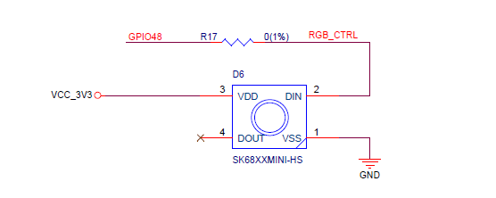

# Matter Light firmware for ESP32-S3

## Windows.

**NB! Untested as yet - I don't have S3 based kit.**

To flash, call flash.bat with comport as first argument and bin file as second - eg...

**flash COM1 light**

NB. You should have esptool.exe installed. (eg  pip install esptool)

Then connect to comport (eg via PuTTY) to monitor the messages.

The following matter commands can be used.

1.  matter device factoryreset - In case the device has been commissioned already.
2.  matter onboardingcodes ble - To get a QRCode for joining fabric

NB. Changed Led Output to GPIO48 for ESP32S3-DevKitM

