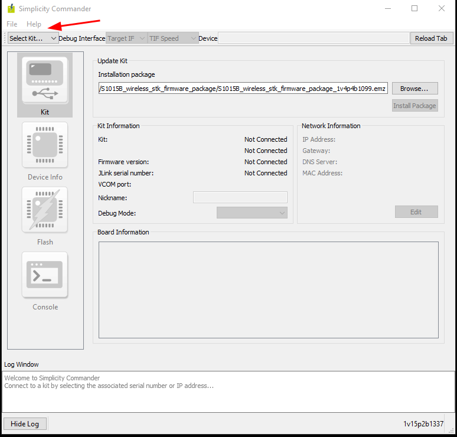
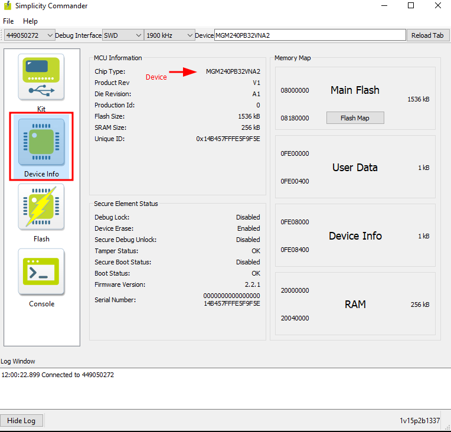
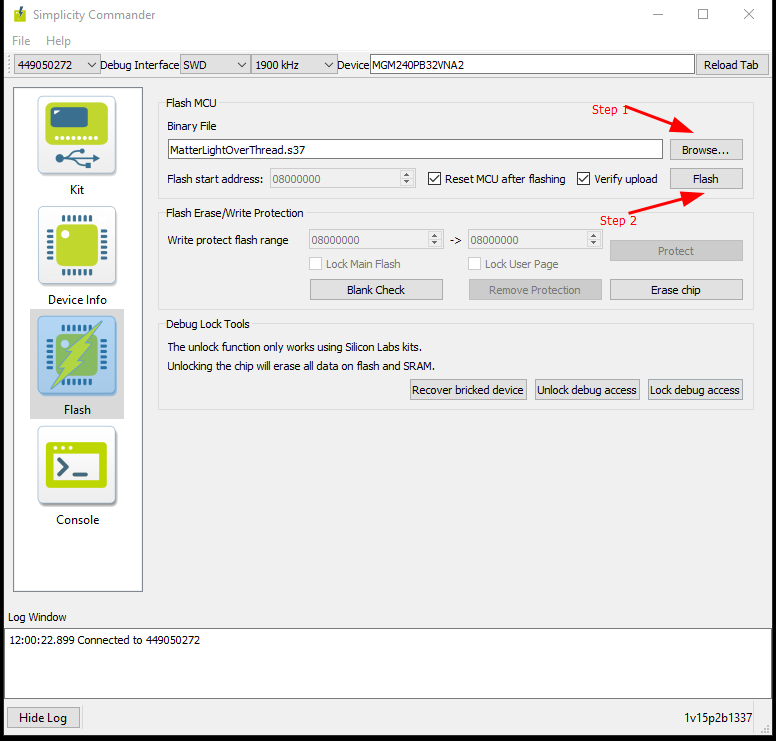

# Sparkfun Thing Plus Matter (STPM)

### This firmware has been tested on Apple Home using a HomePod Mini device.

### Bootloader_Internal-730.s37

Internal Gecko Bootloader - for 1536k device (MGM240)

Must be programmed onto STPM device.

## Applications.

### MatterLightOverThread.s37

- Matter Light Over Thread.

### MatterLightOverThread-Dual.s37

- Matter Light Over Thread.
- Two lights implemented (2 Endpoints).
- Lights are implemented on Ports D2 (Light 1), and D3 (Light 2), Active Low.
- Buttons are implemented on Ports B0 (Function), and B1 (Toggle) - NB debounce needs to be improved!

### MatterOccupancyOverThread.s37

- Matter Occupancy Sensor Over Thread.
- Sleepy End Device (5 sec interval)
- Button 0 - PB0 - Commission
- Button 1 - PB1 - Active Low - Open (No detection), Closed (Detection)
- Tested with Apple Home Pod Mini

---

## Programming the Sparkfun Thing Plus Matter.

Fortunately the STPM has a built in Segger JLink Debug Interface (using SWD) so it's relatively easy to reprogram them with new firmware.

Download (if you don't have it) Simplicity Commander from the Silabs website and extract it to a folder.

There are [Windows](https://www.silabs.com/documents/public/software/SimplicityCommander-Windows.zip), [Mac](https://www.silabs.com/documents/public/software/SimplicityCommander-Mac.zip) and [Linux](https://www.silabs.com/documents/public/software/SimplicityCommander-Linux.zip) installers available.

Run the Commander program and select your Sparkfun Device where it says "Select Kit..." in the top left.

Once selected click the "Device Info" button to see if it connected OK. You should see the Chip Type and various details as below.

If all appears OK, click the large "Flash" button on the left and "Browse" you your application file location, eg where you copied the repository. Then click the small "Flash" button (Step 2) to flash the device.

